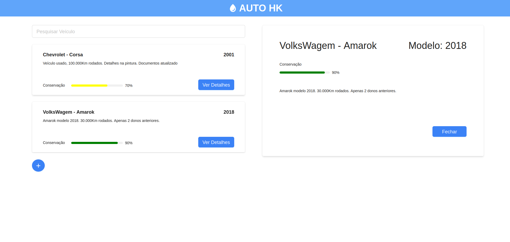
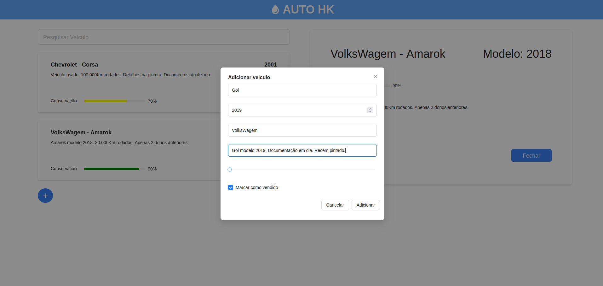

# Interface do Projeto Auto HK

Projeto realizado como treino para o novos integrantes da Haken(Empresa Junior de Ciência da Computação) que ingressaram em 12/2022.

## Como Executar

Este projeto utiliza a API disponível no repositório [ AUTO_HK](https://github.com/DiogoRodriguees/AUTO_HK).

```bash
    # instalando dependencias
    $ yarn

    # executando projeto
    $ yarn  dev
```

## Overview Web Project



